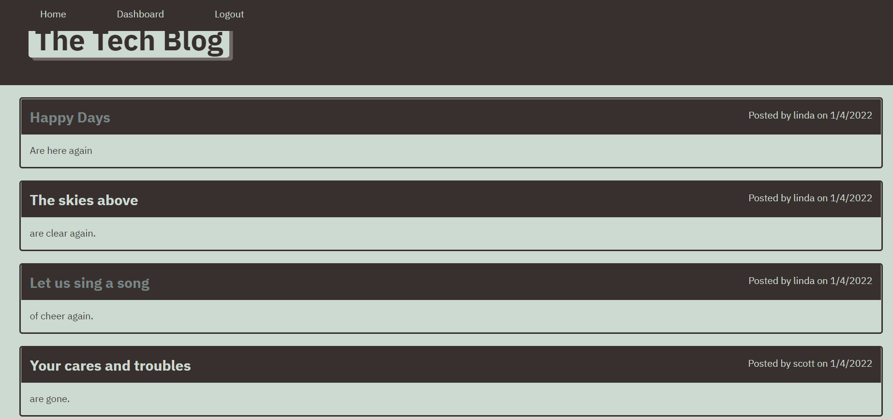
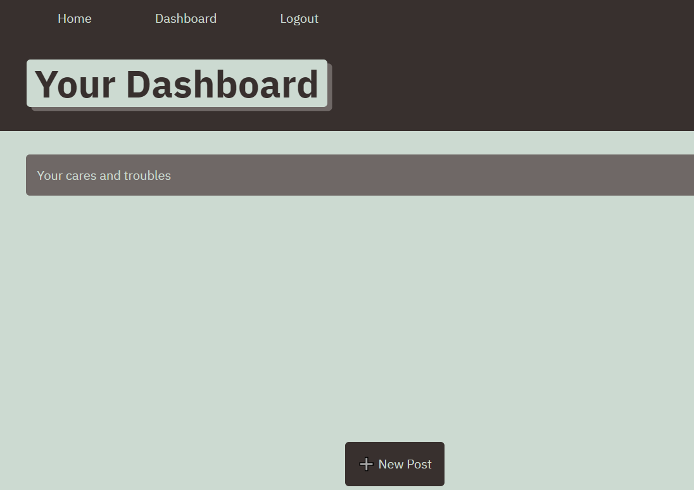

# MVC-Tech-Blog

## Table of Contents
* [Description](#description)
* [Screenshots](#screenshots)
* [Installation](#installation)
* [Usage](#usage)
* [Built With](#built-with)
* [Author](#author)
* [Questions](#questions)
* [Website](#website)
* [License](#license)

## Description

The MVC-Tech-Blog is a CMS-style blog site similar to a Wordpress site, where developers can publish their blog posts and comment on other developers’ posts as well. This site is deployed to Heroku. It follows the MVC (Model-View-Controller) paradigm in its architectural structure, using Handlebars.js as the templating language, Sequelize as the ORM, and the express-session npm package for authentication.

Upon starting, the user can sign up for an account with a username and password.  The password is encrypted when stored in the database using bcrypt.  The user can then login. The menu item "login"  will then change to "logout".  

The homepage displays all posts and associated comments from all users.  Once logged in, the user can comment on anyone's posts. Comments will display the commenter's name and the date it was created.

The dashboard displays posts from the logged in user.  The user can create a new post, or update or delete one of their existing posts. The post will display the creator's name and date it was created.

After being idle for 5 minutes, the user's session will expire and they will have to login again. Whether the user's session expires from being idle or if they click on "logout", the menu item "logout" changes back to "login".

All files describing the models and relationships between the models are under the models directory.

All files describing the user interface/html files are under the views directory.

All files describing the routes are under the controllers directory. 

The application is fully responsive and intuitive to use. 

## Screenshots

### Homepage Image

### Dashboard Image

## Installation

### Download mysql:
* Login to mysql database:
> mysql -u root -p
> "password"

* git clone from the repository
> npm i 

## Usage

### Deployed version: click link (https://mvc-tech-blog-by-linda.herokuapp.com/)

### Installed version:

Login to mysql database:
> mysql -u root -p

> "password"

In a git bash window opened to the MVC-Tech-Blog directory, run

> npm start

Then open up a tab in a browser and go to 
>localhost:3001

## Built With

* Sequelize
* Express
* bcrypt
* dotenv
* node.js
* HTML
* CSS
* Handlebars

## Author

[Linda Waterhouse](https://github.com/llwaterhouse)

## Questions

If you have any questions or would like to contribute, please contact me via my Github link above.

## Website

[Deployed website](https://mvc-tech-blog-by-linda.herokuapp.com/)

## License

MIT License 

Copyright (c) [2021] [MVC-Tech-Blog]

Permission is hereby granted, free of charge, to any person obtaining a copy
of this software and associated documentation files (the "Software"), to deal
in the Software without restriction, including without limitation the rights
to use, copy, modify, merge, publish, distribute, sublicense, and/or sell
copies of the Software, and to permit persons to whom the Software is
furnished to do so, subject to the following conditions:

The above copyright notice and this permission notice shall be included in all
copies or substantial portions of the Software.

THE SOFTWARE IS PROVIDED "AS IS", WITHOUT WARRANTY OF ANY KIND, EXPRESS OR
IMPLIED, INCLUDING BUT NOT LIMITED TO THE WARRANTIES OF MERCHANTABILITY,
FITNESS FOR A PARTICULAR PURPOSE AND NONINFRINGEMENT. IN NO EVENT SHALL THE
AUTHORS OR COPYRIGHT HOLDERS BE LIABLE FOR ANY CLAIM, DAMAGES OR OTHER
LIABILITY, WHETHER IN AN ACTION OF CONTRACT, TORT OR OTHERWISE, ARISING FROM,
OUT OF OR IN CONNECTION WITH THE SOFTWARE OR THE USE OR OTHER DEALINGS IN THE
SOFTWARE.

